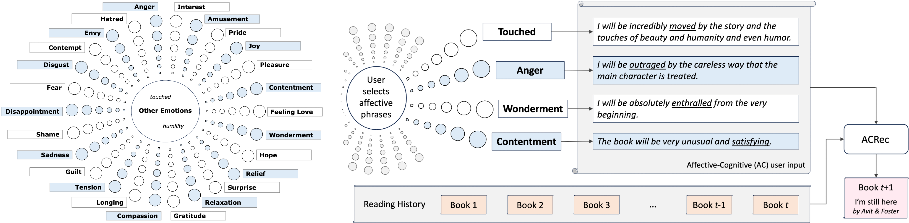

# ACRec (EMNLP 2025)
# A Text-Based Recommender System that Leverages Explicit Affective State Preferences
---

## Overview 
The affective attitude of liking a recommended item reflects just one category in a wide spectrum of affective phenomena that also includes emotions such as entranced or intrigued, moods such as cheerful or buoyant, as well as more fine-grained affective states, such as "pleasantly surprised by the conclusion". In this paper, we introduce a novel recommendation task that can leverage a virtually unbounded range of affective states sought explicitly by the user in order to identify items that, upon consumption, are likely to induce those affective states.  Correspondingly, we create a large dataset of user preferences containing expressions of fine-grained affective states that are mined from book reviews, and propose a Transformer-based architecture that leverages such affective expressions as input. We then use the resulting dataset of affective states preferences, together with the linked users and their histories of book readings, ratings, and reviews, to train and evaluate multiple recommendation models on the task of matching recommended items with affective preferences. Experiments show that the best results are obtained by models that can utilize textual descriptions of items and user affective preferences.

## 🗂️ Repository Structure

### `dataset_creation/`
Prompts used for constructing the ACRec dataset.

#### `phase_1/`
Initial prompt-based extraction of Affective (A), Cognitive (C), and Affective-Cognitive (AC) statements from book reviews.

- `guidelines.txt`: Detailed annotation guidelines for identifying and distinguishing between A, C, and AC statements.
- `ICL_examples.txt`: In-context learning examples provided to the LLM to ensure correct extraction and classification of statements.
- `prompt.txt`: Prompt template used in Phase 1 to generate structured AC statements from raw Goodreads reviews.

#### `phase_2/`
Refinement phase to correct misclassifications and improve type separation.

- `phase_2_prompt.txt`: Prompt for correcting misclassified outputs from Phase 1 and improving separation between affective and cognitive statements

### `emotion_classification/`
Emotion categorization of extracted affective statements.

- `prompt.txt`: Prompt used to classify each A or AC statement into one of the 26 categories emotion based on a modified Geneva Emotion Wheel.

---
